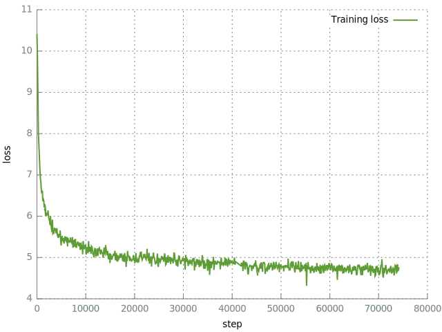

# Train

We train a [Transformer](http://jalammar.github.io/illustrated-transformer/) translation model 
on the extracted title-comment pairs. In other words, we consider the prediction of comments
as a translation problem, by modelling `p(comment|title)`. This can also be interpreted as a
language model conditioned on the title.

It is not obvious to me if this should work at all, since I assume that the `p(comment|title)`
in what a comment could be talking about. I guess let's just see what happens.

## Data Preparation
See [../data](../data).

## Shuffle
Now that we're done with data preparation, let's prepare the data some more.
```
paste ../data/data.train.bpe.{titles,comments} | shuf > data.train.bpe.shuf.titles-comments
cut -f1 < data.train.bpe.shuf.titles-comments > data.train.bpe.shuf.titles
cut -f2 < data.train.bpe.shuf.titles-comments > data.train.bpe.shuf.comments
```

## Vocabularies
Since titles are lowercased and comments are not, and comments contain other additional symbols,
such as Markdown or links, we build two vocabularies:
```
onmt-build-vocab --save_vocab vocab.titles data.train.bpe.shuf.titles
onmt-build-vocab --save_vocab vocab.comments data.train.bpe.shuf.comments
```

## Train
Adjust settings and paths in `opennmt_config.yml` if necessary. Let's hope TensorFlow is ready
to go, and start training. OpenNMT-tf will save checkpoints periodically (as configured),
so training can be continued from there in case something crashes or if your mother rips out
the power plug.
```
onmt-main train --config opennmt_config.yml --model_type Transformer --num_gpus 1
```



## Evaluate
